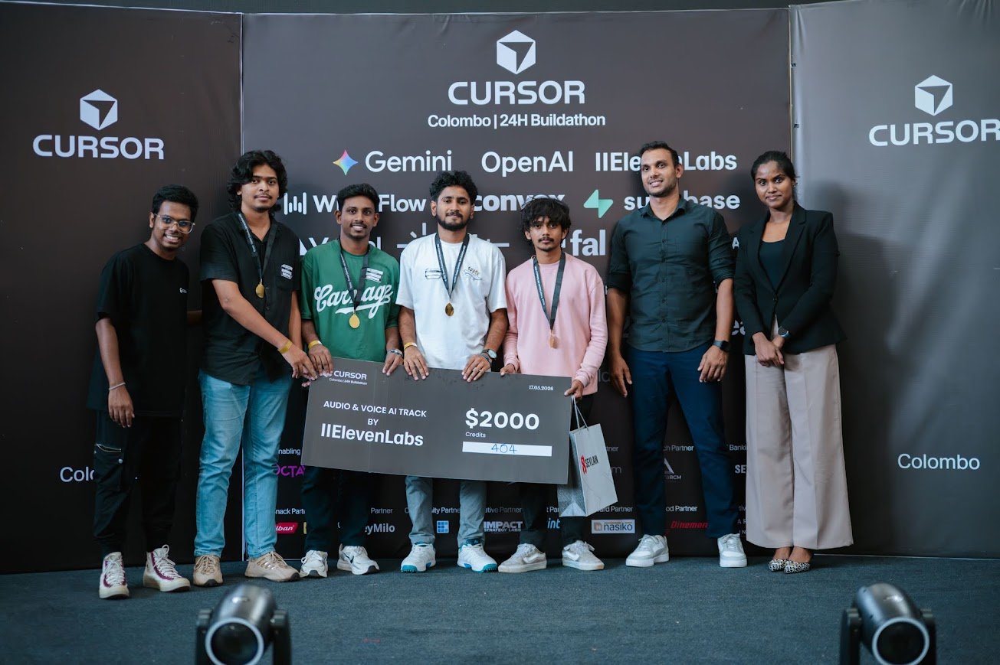

# Hospital Sign-to-Voice Assistant




Hospital accessibility web app that translates a small set of predefined hand signs into spoken phrases.

## Live Demo
- Primary demo: [https://vello.adheesha.dev/](https://vello.adheesha.dev/)
- Static gatekeeper page: [https://vello-static.pages.dev/gatekeeper](https://vello-static.pages.dev/gatekeeper)

## Stack
- Frontend: Next.js + TypeScript + TailwindCSS
- Backend: FastAPI + OpenCV + MediaPipe
- Voice: ElevenLabs API (with browser speech fallback)

## Features
- Live camera feed
- Hand landmark detection
- Six predefined hospital intent signs
- Intent-to-phrase mapping
- Voice output
- Demo mode fallback
- Static frontend export support

## Supported Signs

- `yes`: "Yes." Closed fist, ideally with a short up/down nodding motion.
- `no`: "No." Index and middle fingers extended together, thumb/ring/pinky down.
- `pain`: "I am in pain." Two hands visible, each with index finger extended, index fingers close together.
- `water`: "I need water." Index, middle, and ring fingers extended in a W-like shape.
- `help`: "Please help me." Thumb-up or loose fist hand supported by the other open palm.
- `stop`: "Please stop." Open-palm stop/chop pose, best with both hands visible.

The current detector is rule-based by default, so clear lighting, a centered hand, and visible fingers improve recognition.

## Project Structure
- `frontend/`: Next.js app for camera permission, detection UI, and voice playback.
- `backend/`: FastAPI service for hand detection, gesture classification, phrase mapping, and voice generation.
- `shared/`: Shared phrase and gesture alias data used by frontend/backend docs and mappings.
- `docs/`: Architecture, API flow, demo, ASL verification, and dataset notes.

## Docker Setup
Use Docker Compose so contributors do not need local Python/Node setup.

### Prerequisites
- Docker Desktop installed and running
- Ports `3000` and `8000` available

### Start full stack
From project root:

```powershell
docker compose up --build
```

Note: frontend runtime cache (`.next`) is isolated in a container volume to avoid host/container cache mismatch errors during hot reload.

### Open app
- Frontend: `http://localhost:3000`
- Camera gatekeeper: `http://localhost:3000/gatekeeper`
- Detection studio: `http://localhost:3000/studio`
- Backend health: `http://localhost:8000/health`

### Stop stack
In the same terminal:

```powershell
Ctrl + C
```

Or detached mode:

```powershell
docker compose up -d --build
docker compose down
```

### Rebuild after dependency changes
```powershell
docker compose build --no-cache
docker compose up
```

## Train Intent Model
You can train the backend intent model from captured gesture data or a Kaggle export.

1. Open backend folder and install requirements.
2. Run training script:
   ```powershell
   python scripts/train_intent_model.py --input app/data/gesture_samples.jsonl --labels yes,no,pain,water,help,stop
   ```
3. For a Kaggle ASL fingerspelling export, map letters to intents:
   ```powershell
   python scripts/train_intent_model.py --input "C:\path\to\kaggle_export.csv" --labels yes,no --map y=yes --map n=no
   ```
4. Run backend with model mode:
   - `CLASSIFIER_MODE=model`
   - `MODEL_FILE=app/data/models/gesture_centroid_model.json`

## ASL verification

The repository uses a constrained hospital sign set with canonical ASL labels where available. See [docs/ASL_verification.md](docs/ASL_verification.md) and [shared/gesture_aliases.json](shared/gesture_aliases.json) for mapping notes.

## Documentation index
Developer and design docs live in the `docs` folder. Start at [docs/README.md](docs/README.md) for an index of documents.

## Contributing
- Use the `docker compose` flow for reproducible development environments.
- Open issues for bugs/feature requests and add concise repro steps.

